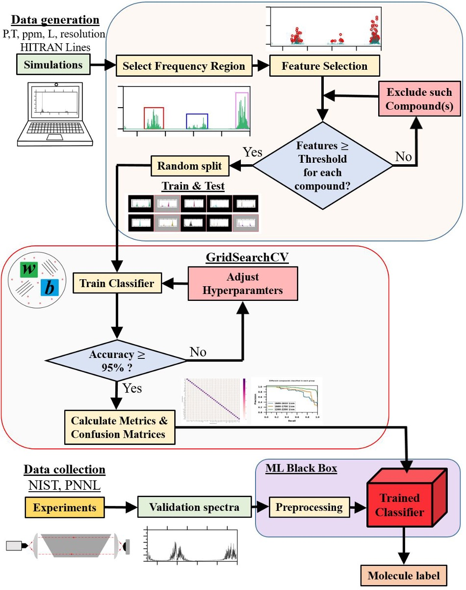

# IR_SVM: Infrared Spectra Detection via Support Vector Machine Framework

Software for intelligent detection of IR spectra. 

  

## Installation

1. Clone the repository.
2. Install the required packages.

## Instructions

1. Run the code inside workflow directory to perform analysis.
2. Use the GUI classifier for classifying experimental spectra.

## Developer

M Arshad Zahangir Chowdhury

## Data, ideas and supervision

Tim E. Rice

Matthew A. Oehlschlaeger

## Affiliation

Rensselaer Polytechnic Institute

## License
MIT License

## Funding

This project was funded by a National Science Foundation Grant.

## Publication

Chowdhury, M.A.Z., Rice, T.E. & Oehlschlaeger, M.A. A support vector machines framework for identification of infrared spectra. Appl. Phys. B 128, 161 (2022). 
https://doi.org/10.1007/s00340-022-07879-8
